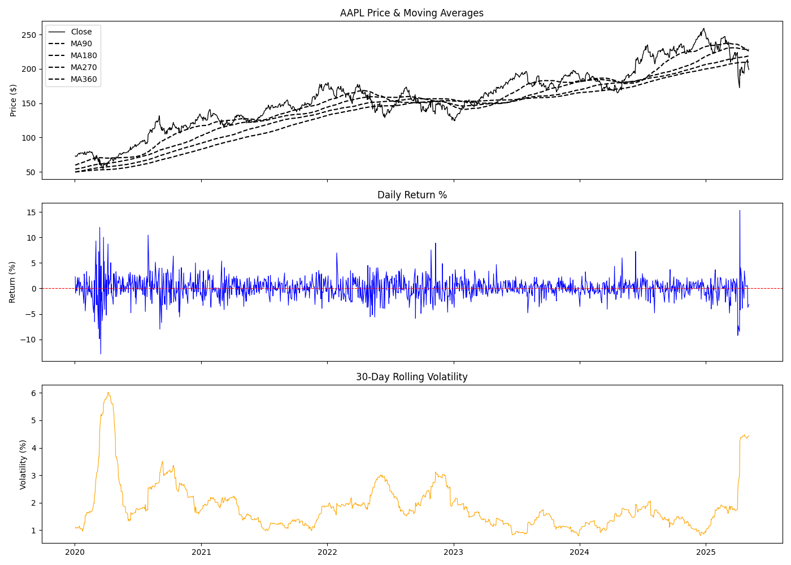

# AAPL Stock Market Analysis

A Python-based data analysis project that explores Apple Inc. (AAPL) stock performance from 2020 to present. The project calculates key financial metrics, visualizes price trends, and generates plain-English insights from the data.

---

## Project Goals

- Load and clean historical AAPL stock data
- Calculate moving averages, daily returns, and volatility
- Visualize price trends, daily returns, and market volatility in a single dashboard
- Summarize findings in a readable, automated insights report

---

## Charts



The dashboard includes three panels:

**1. Price & Moving Averages** — AAPL's closing price plotted alongside four moving averages (MA90, MA180, MA270, MA360). When the price falls below the moving averages, it signals a bearish trend; above them signals bullish momentum.

**2. Daily Return %** — How much the stock moved each day as a percentage. The red dashed line at 0 makes it easy to spot clusters of losing or winning days.

**3. 30-Day Rolling Volatility** — How wildly the stock has been swinging on average over the past month. Two major spikes are visible: COVID-19 in early 2020, and tariff-driven uncertainty in early 2025.

---

## Key Findings (as of May 2025)

| Metric | Value |
|---|---|
| Latest Close | $198.89 |
| MA90 (3-month avg) | $226.07 |
| MA180 (6-month avg) | $228.13 |
| MA270 (9-month avg) | $218.55 |
| MA360 (1-year avg) | $210.00 |
| Volatility | 4.44% (HIGH) |
| Last Daily Return | -3.15% (down day) |
| Trend | MIXED (bearish lean) |

**Takeaways:**
- AAPL is currently trading **below all four moving averages**, indicating sustained downward pressure since late 2024
- Volatility at **4.44%** is nearly double the stock's normal range of 1–2%, reflecting broader market uncertainty
- The sharp drop visible in the 2025 section of the chart coincides with tariff-related market turbulence

---

## How to Run

**Prerequisites**
- Python 3.10+
- pip or uv

**Install dependencies**
```bash
pip install pandas matplotlib yfinance
```

**Run the analysis**
```bash
python stock_analysis.py
```

This will print the latest metrics to the terminal, display the 3-panel chart, and save it to `charts/aapl_analysis.png`.

---

## Project Structure

```
stock_market_analytics/
│
├── stock_analysis.py       # Main script
├── charts/
│   └── aapl_analysis.png   # Generated chart
└── README.md
```

---

## Functions

| Function | Description |
|---|---|
| `load_data()` | Loads the CSV, filters for AAPL, cleans and formats the date index |
| `calculate_metrics(df, start_date)` | Adds MA90/180/270/360, daily return, and rolling volatility columns |
| `get_insights(df)` | Prints a plain-English summary of the latest metrics and trend signals |
| `plot_charts(df)` | Generates and saves the 3-panel dashboard chart |

---

## Author

**Emmanuel Yeboah**
[github.com/mannyyebz](https://github.com/mannyyebz) · emmyeb9@gmail.com 